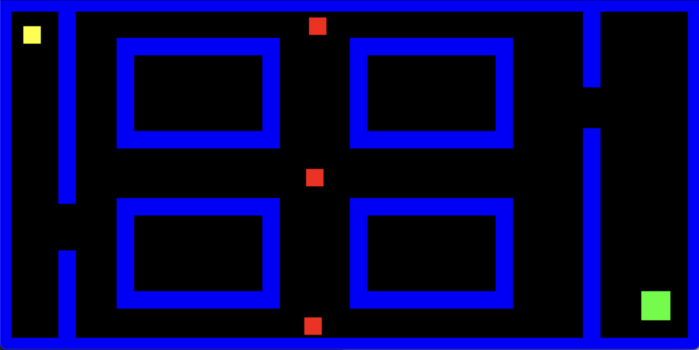

# Tutorial Gioco del Labirinto 2d in pygame

## Introduzione

Benvenuto nel Gioco del Labirinto, un gioco sviluppato con Pygame in cui controlli un quadrato giallo che deve attraversare un labirinto, evitando nemici in movimento e raggiungendo l’obiettivo verde per vincere.

## Lezioni

In questa repository ti insegneremo a creare questo gioco da zero usando PyGame, abbiamo divisdo tutto il lezioni con codice e spiegazione per ogni lezione :
- [Lesson 1: PyGame, la classe Rect. e le sue funzioni.](lesson1)
- [Lesson 2: Il giocatore e il suo movimento, ostacoli e arrivo.](./lesson2)
- [Lesson 3: Nemici ed il loro movimeto.](lesson3)
- [Lesson 4: Prova finale comprensiva di tutto.](lesson4)
